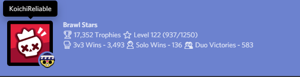
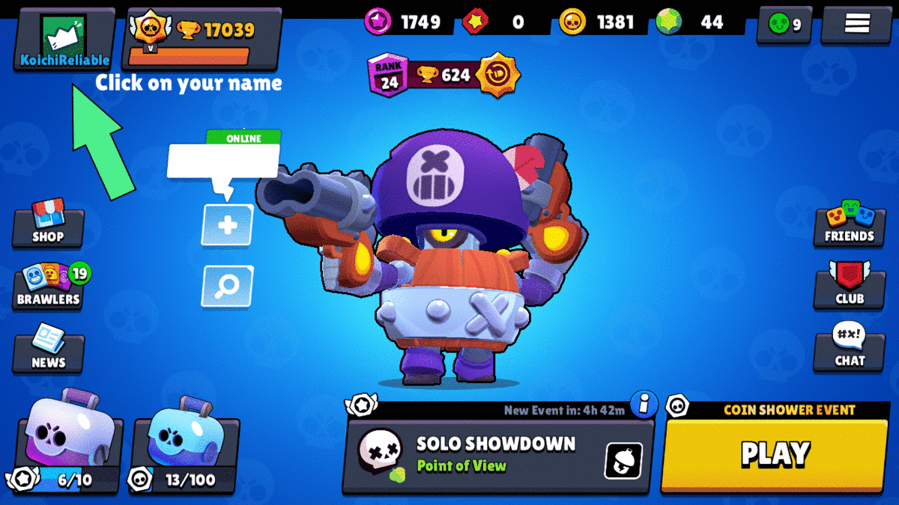

# Brawl-Stars-Discord-RPC
Flex your Brawl Stars stats with this Rich Presence!

# Downloading Node.js (REQUIRED!)

[Go Here to Download Node.js](https://nodejs.org/en/download/). The version does not matter, as long as its somewhat recent

# Instructions

These are some instructions on how to get the RPC up and running!

## Getting your Tag

When you get your tag, go to the config.json file and replace "Put your user tag here" with your actual tag

## Getting the Brawl Stars API Key:

# Step 1:

Go to https://developer.brawlstars.com/

# Step 2:

Create an Account and Verify

# Step 3

Go to your Account Page and create an API Key ([This should automatically link you to your account](https://developer.brawlstars.com/#/account))

Note, you must whitelist your IP. If you don't know your IP, then go [Here](https://whatismyip.com) to find out.

When you get your API key, go to the config.json file and replace "Put your Brawl Stars API Key Here" with your actual API Key

## Installing Packages

Go to the command prompt, and use the `cd` command to go to wherever you placed the files. Then run `npm install`. It should install all the packages required from `package.json`

## Running the RPC

If you just finished installing the files, just run `node .` and it should start up.

If it says that node is not a valid command, then [you must install node here](https://nodejs.org/en/download/)

If all goes well, then it should appear on your discord profile! If it doesnt, then it will tell you what went wrong. If it tells you to go to report on GitHub, then [Report Here](https://github.com/ThatMajesticGuy/Brawl-Stars-Discord-RPC/issues)

Thank you for using this RPC, and have fun flexing your stats!
